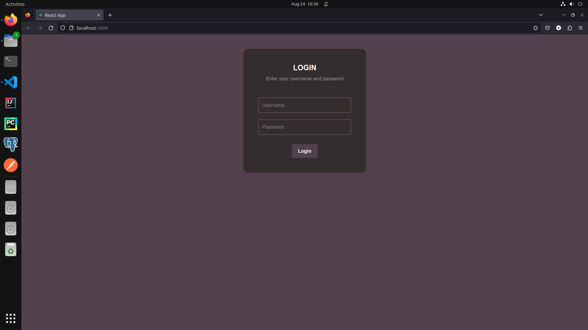

# KUSYS-Demo-WebAppProject

# Introduction

A web application built for efficient student management. For educators, who would like to
manage their students, and for students, which would like to select courses for themselves, this
web application would come in handy, for it provides CRUD operations based on role connected
to a database with a nice UI.

# Features

- Student Management: The admins can create, update, and delete student records easily.
This feature make sure that accurate and up to date student information.
- Student Details and Listing: The application allows users to (whether admin or standard
user) view a list of all students, and see their details. Based on role, admins can see all
students’ courses, while the standard users can only see their own courses.
- Course Selection: Students can be matched with a selection of courses. While admins
can set all students courses, a standard user is only able to select their own courses.
- Login Mechanism: The app has a secure, simple login page. This sets role-based access
control.

   
# Screenshots

  

  

  

  

  

